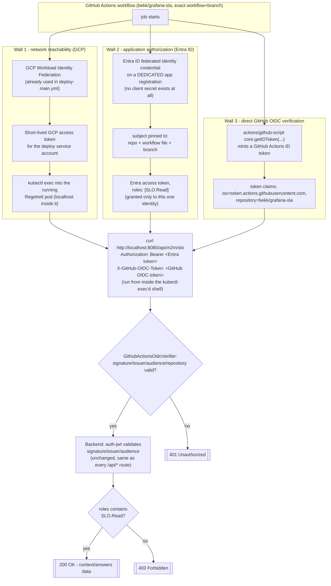

# M2M auth for the cross-team SLO export

How a GitHub Action — and *only* that one GitHub Action, no other app and no
human user — can read all teams' context/answer data for the
Sikkerhetskontroller and Driftskontinuitet schemas
(`GET /api/m2m/slo`).

- [concepts/](./concepts/) — what an app role is, what member types mean,
  the client credentials flow, and federated identity credentials
- [setup.md](./setup.md) — step-by-step Entra ID + GCP setup
- [comparison.md](./comparison.md) — how this fits alongside the other auth
  mechanisms already used on endpoints in this codebase

## Why this was needed

Every existing `/api/*` route is protected by the `auth-jwt` Ktor provider,
with authorization built on an **on-behalf-of (OBO)** exchange of the
*calling user's own* token against Microsoft Graph
(`AuthService.hasTeamAccess`/`hasContextAccess`). That requires a real
signed-in human — there's no user behind a scheduled job, so this path is a
dead end for a headless caller.

An earlier version of this design reused the shared "Regelrett" login app's
own secret to get a self-granted role. That turned out not to satisfy the
actual requirement: **strictly only this GitHub Action, nobody else** —
anything holding that same shared login secret could mint an
export-capable token too. Network-level restriction can't fill the gap
either, since GitHub-hosted runners share IP ranges across every GitHub
customer. The design below fixes that.

## Proposed solution, in short

Reaching the data now requires passing **three independent trust chains** in
the same workflow run. None of them alone is enough — this is deliberate
defense in depth, and critically, **none of them uses a secret that could be
leaked, copied, or reused elsewhere**:

The calling workflow lives in a separate repo, **`bekk/grafana-sla`** — not
in this repo. Every "pinned to this exact repo" below means
`bekk/grafana-sla`'s workflow, not `bekk/Regelrett.sla`'s.

- **Wall 1 — network reachability.** The cluster's `NetworkPolicy` still
  default-denies everything from outside. The calling workflow needs its
  **own** GCP Workload Identity Federation trust (separate from the one
  `deploy-main.yml` uses for this repo's own deploys) so it can authenticate
  to GCP, then `kubectl exec`s into the running pod and calls `localhost`
  from inside it. This only proves "this workflow can reach GCP" — it says
  nothing about who's allowed to see the data.
- **Wall 2 — application authorization (Entra).** This is the main
  access-control gate. A **[app role](./concepts/app-roles.md)**,
  `SLO.Read` (member type [`Application`](./concepts/member-types.md),
  so no human login can ever hold it), is granted to **one single, dedicated
  app registration** created for no other purpose than this workflow. That
  app has **no client secret at all** — its only credential is a
  **[federated identity credential](./concepts/federated-identity.md)**
  whose `subject` is cryptographically pinned to `bekk/grafana-sla`'s
  workflow file + branch. Nobody — not even someone with full Entra admin
  access — can manually mint a token as this identity, because there is no
  password to use. The only way to get one is a genuine OIDC assertion from
  an actual run of that exact workflow. The backend reads the resulting
  token's `roles` claim and returns `403` if `SLO.Read` isn't there — it
  reuses the exact same JWT signature/issuer/audience validation every
  other `/api/*` route already goes through
  (`src/main/kotlin/no/bekk/routes/M2mSloRouting.kt`).
- **Wall 3 — direct GitHub OIDC verification.** Layered on top of Wall 2,
  not instead of it. The workflow also mints a GitHub Actions ID token
  (`actions/github-script`'s `core.getIDToken(...)`) and sends it in a
  separate `X-GitHub-OIDC-Token` header. The backend verifies this token
  itself, directly against GitHub's own JWKS
  (`https://token.actions.githubusercontent.com/.well-known/jwks`), checking
  issuer, audience, and that the `repository` claim is exactly
  `bekk/grafana-sla`
  (`src/main/kotlin/no/bekk/authentication/GithubActionsOidcVerifier.kt`).
  This is a second, independently-rooted check: even if Entra's federated
  credential config were ever misconfigured or the dedicated app
  registration compromised, a caller would still need a genuine GitHub
  Actions OIDC token minted by a real run of that exact workflow in
  `bekk/grafana-sla`.

The app role stays declared on the existing "Regelrett" app registration
(the resource) rather than a second, fully separate app registration — the
exclusivity above comes entirely from *who the role is granted to*, not
*which app declares it*, so a second app registration would only add a
second token audience for the backend to validate, for no extra security.

## Flow

See [setup.md](./setup.md) for the concrete Entra ID + GCP setup, and
[comparison.md](./comparison.md) for how this sits alongside the other auth
mechanisms already on endpoints in this codebase.
